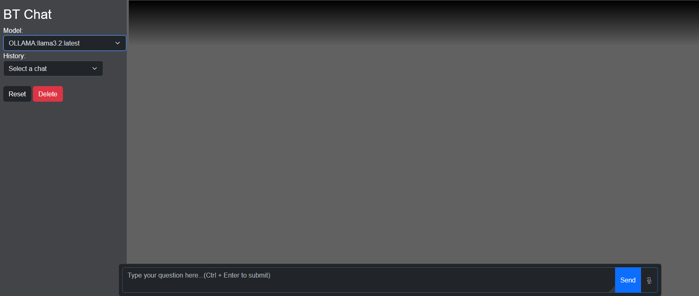

# Project Title

BT AI UI

## Description

A simple micro--app UI for ollama using Rust. Support tools, and it is
configurable via YAML files.

## Usage

1.  Compile the Rust code
2.  Download the executable
3.  Download the site, config, and defs folders
4.  Download the files in the linux_service folder
5.  run install.sh

The program runs as a Linux service but can be run manually.

### Manually run:

1.  Compile the Rust code
2.  Download the executable
3.  Download the site, config, and defs folders
4.  run ai_ui

## Dependencies

ollama and ollama models

## Version History
*   0.1.0
    * Initial Release
*   0.1.1
    * Decouple the AI server from the main. Update dependencies and adjust code.
*   0.2.0
    * Rearchitech move to use github dependencies

## License
GPL-3.0-only